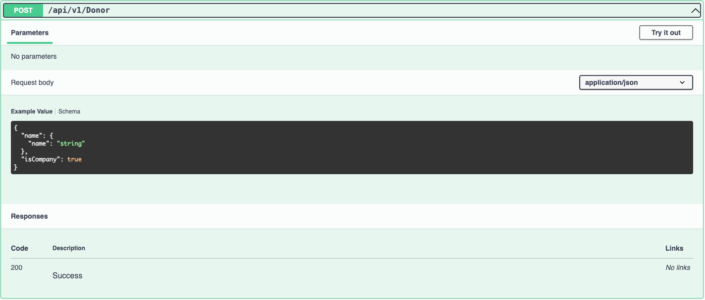
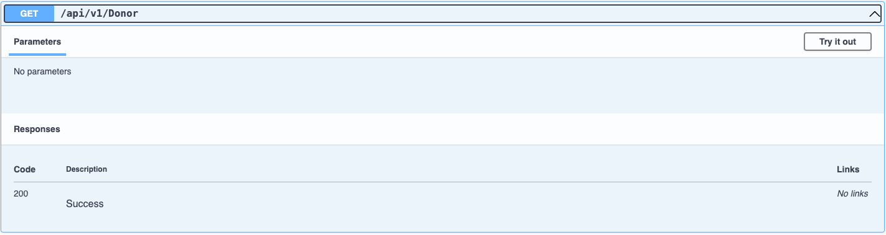
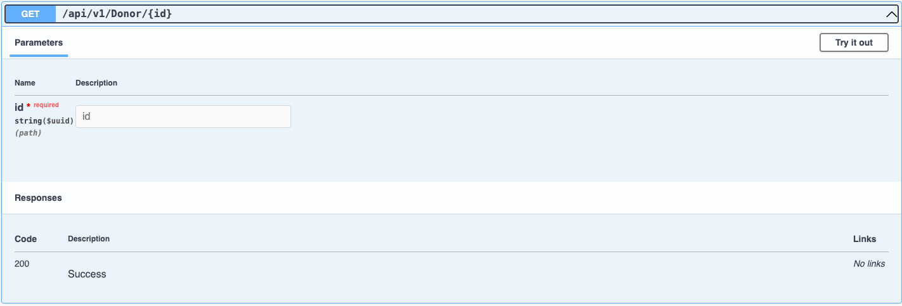
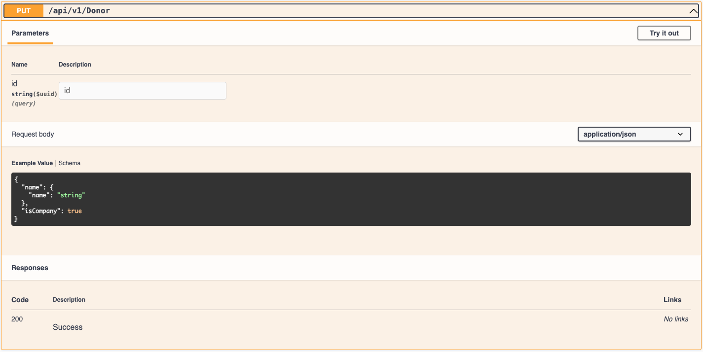
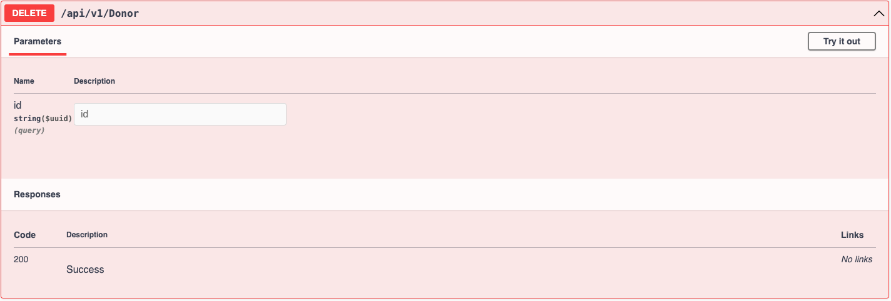
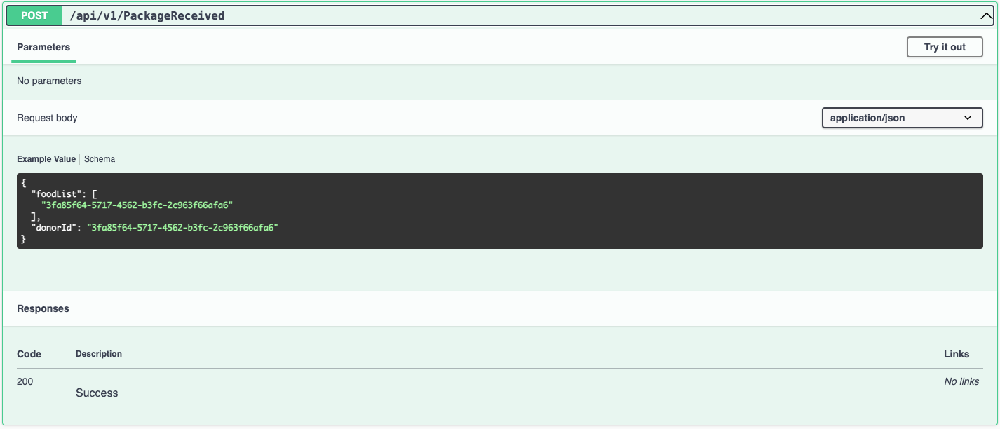
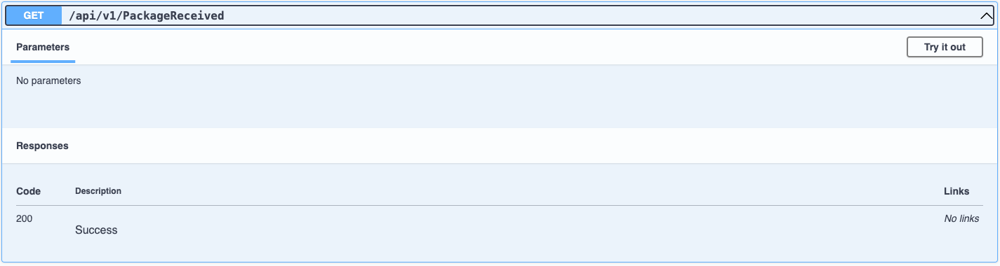
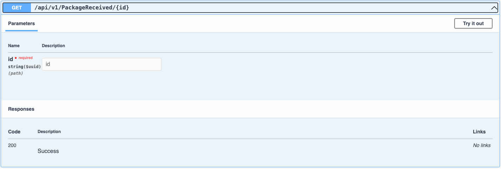
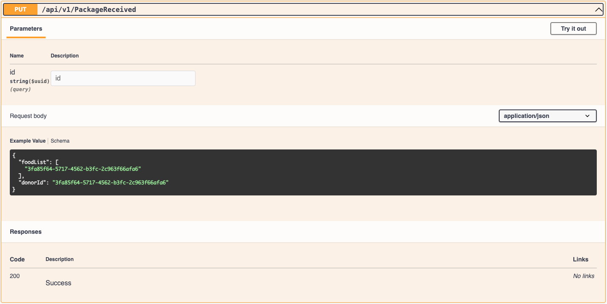
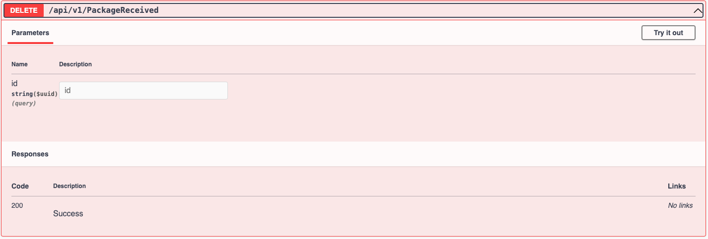

# Application layer

## Table of Contents

- [Application](#application)
- [Structure](#structure)

---

## **APPLICATION**

- If you are running locally, is most likely that the Swagger will be available at:
    - http://localhost:5001/swagger/index.html

---

## **STRUCTURE**

### Donor / Receiver / Food

Follow the structure below
> - **Post**
    >
- 

> - **Get all**
    >
- 

> - **Get by Id**
    >
- 

> - **Put**
    >
- 

> - **Delete**
    >
- 

### Package Received / Package Sent

Follow the structure below
> - **Post**
    >
- 

> - **Get all**
    >
- 

> - **Get by Id**
    >
- 

> - **Put**
    >
- 

> - **Delete**
    >
- 